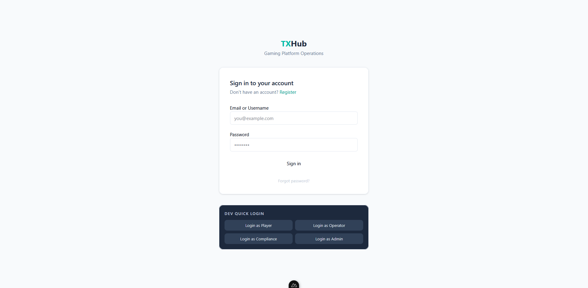
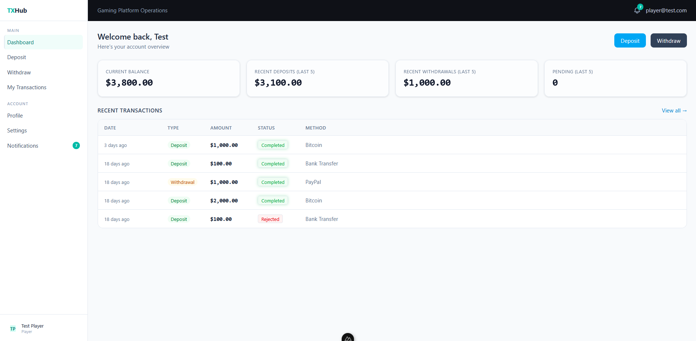
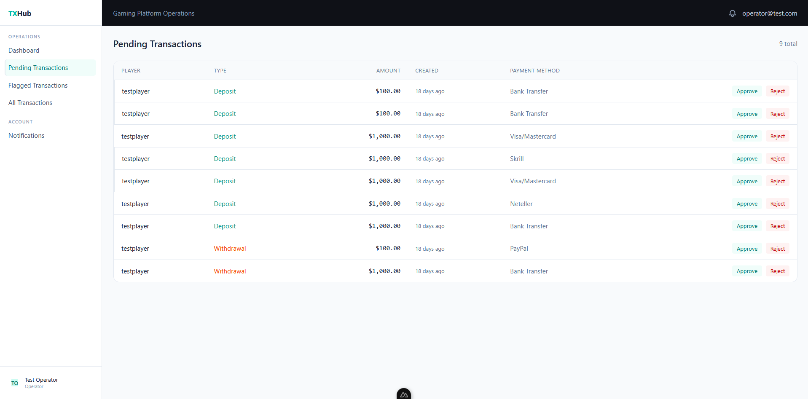
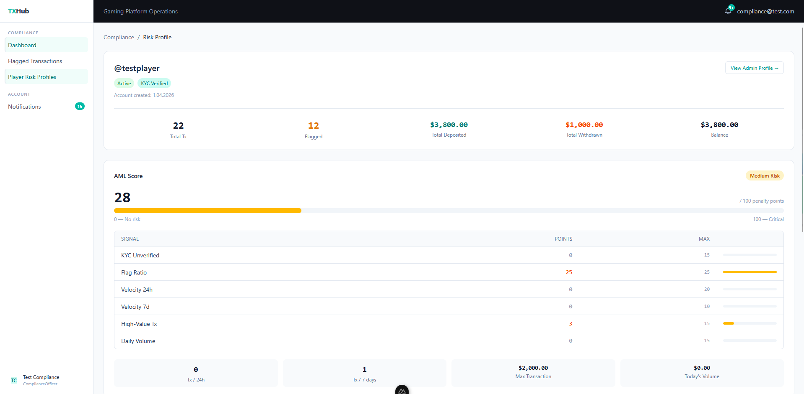
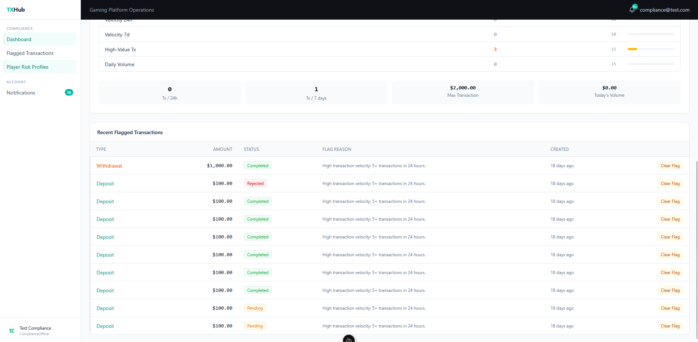
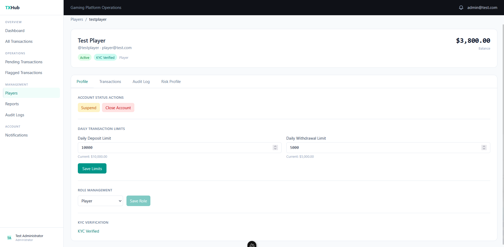
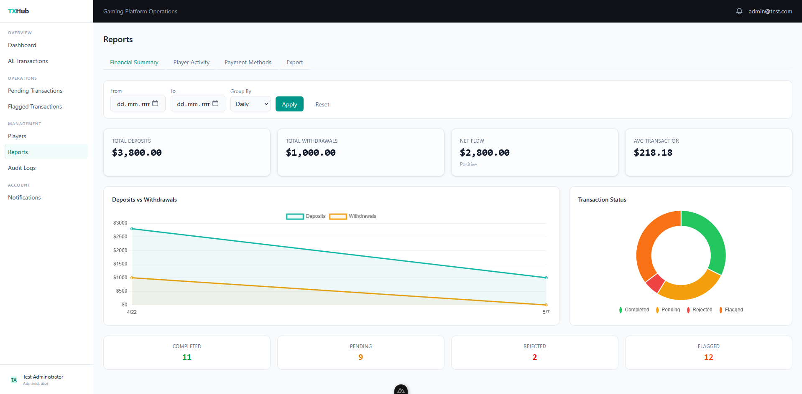
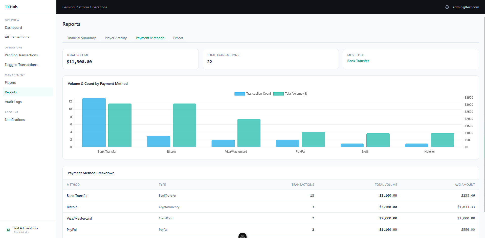
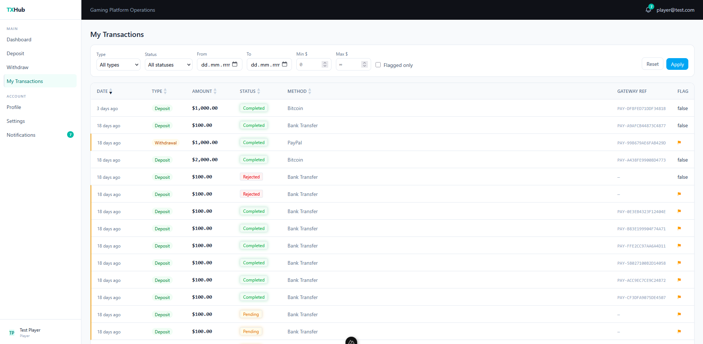

# Player Transaction Hub

A full-featured gaming platform operations dashboard built as a portfolio project. Covers the entire transaction lifecycle — from player deposits and withdrawals through operator approval queues to compliance risk profiling and admin reporting.

## Features

- **Player portal** — deposit/withdraw with payment method selection and daily-limit validation
- **Operator queue** — approve or reject pending transactions with notes/reason
- **Flagged transaction queue** — review AML-flagged transactions, clear flags with audit notes
- **Compliance dashboard** — risk profiles per player, flagged transaction summary
- **Admin panel** — player management (status, limits, KYC, role), audit logs with diff view
- **Reports** — financial summary (line chart), status breakdown (donut chart), payment-method stats (bar chart), CSV export
- **Role-based access** — Player / Operator / ComplianceOfficer / Administrator with middleware guards
- **Notification polling** — unread badge updates every 30 s

## Tech Stack

| Concern | Choice |
|---|---|
| Framework | Nuxt 4 (Vue 3 Composition API, SPA mode) |
| Styling | Tailwind CSS v4 |
| UI components | shadcn-vue (reka-ui) |
| State management | Pinia |
| Form validation | vee-validate + zod v4 |
| Charts | Chart.js 4 + vue-chartjs 5 |
| HTTP client | ofetch (`$fetch`) via Nuxt plugin |
| Auth | JWT access token in localStorage; refresh token in memory only (XSS mitigation) |

## Prerequisites

- **Node.js 20+**
- **.NET 10 SDK** (for the backend)

## Setup

### 1 — Backend

Clone and run the ASP.NET Core backend (separate repository). It must be reachable at `http://localhost:5235`.

```bash
dotnet run
```

Swagger UI is available at `http://localhost:5235/swagger`.

### 2 — Frontend

```bash
# Clone this repository
git clone <repo-url>
cd player-transaction-hub

# Install dependencies (.npmrc sets legacy-peer-deps automatically)
npm install

# Start the dev server
npm run dev
```

Open `http://localhost:3000`.

### Build for production

```bash
npm run build
```

## Demo Accounts

Password for all accounts: **`TestPass123!`**

| Role | Email | Username |
|---|---|---|
| Administrator | admin@test.com | testadmin |
| Operator | operator@test.com | testoperator |
| Compliance Officer | compliance@test.com | testcompliance |
| Player | player@test.com | testplayer |

The quick-login banner on `/login` lets you sign in as any role with one click (dev mode only).

## Project Structure

```
app/
├── assets/css/main.css          # Tailwind v4 entry + CSS variables
├── components/
│   ├── common/                  # AppBadge, AppStatCard, AppDataTable, AppModal, ...
│   ├── auth/                    # LoginForm, RegisterForm, DevLoginBanner
│   ├── transactions/            # TransactionFilters, ApproveModal, RejectModal, ...
│   ├── compliance/              # ClearFlagModal
│   ├── admin/                   # PlayerStatusActions, PlayerLimitsForm
│   └── reports/                 # FinancialChart, StatusDonutChart, PaymentMethodBarChart
├── composables/                 # useCurrency, useRelativeTime, usePagination
├── layouts/                     # default.vue (topbar + sidebar), auth.vue
├── middleware/                  # auth.ts, role.ts
├── pages/                       # File-based routing
├── plugins/                     # api.ts ($fetch + auth interceptor), auth-init.ts, chart.ts
├── stores/                      # auth, notifications, transactions, players, ui
└── types/api.ts                 # All TypeScript interfaces
```

## Screenshots


*Login page with one-click dev login banner for each role*


*Player dashboard — balance overview, recent transactions, quick deposit/withdraw actions*


*Operator approval queue — review pending transactions, approve or reject with notes*


*Compliance risk profile — AML score, velocity and volume indicators per player*


*Compliance risk profile (cont.) — flagged transaction history with one-click flag clearing*


*Admin player management — status controls, KYC verification, limits, and role assignment*


*Reports — financial summary with line chart, date range selector, and key metrics*


*Reports — payment method breakdown: bar chart by volume/count and detailed stats table*


*Transaction list with advanced filtering (status, type, date range, amount) and sortable columns*
